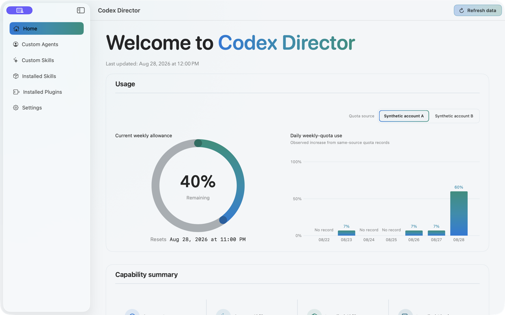
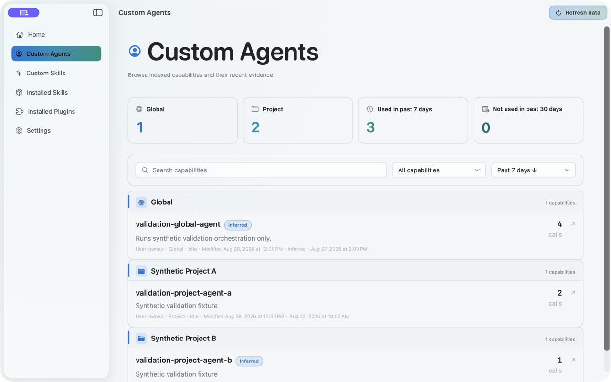
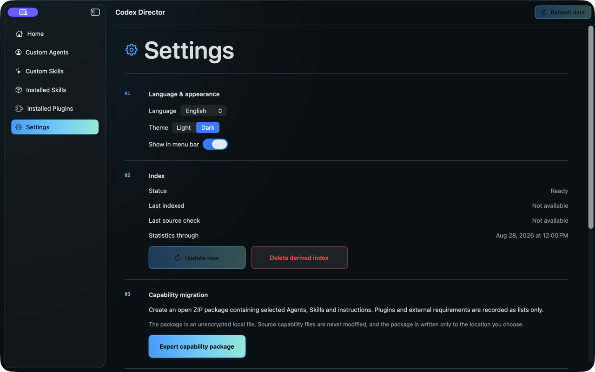

# Codex Director

Codex Director is a native macOS application for understanding and moving your personal Codex capability system. It inventories Agents, Skills, installed plugins, project usage evidence, and manual evaluations without treating activity as proof of effectiveness.

> Current development version: `1.0.0`. Requires macOS 26 or later.

[简体中文](README.zh-CN.md)

## What it does

- Inventories global, installed, and project-level Agents and Skills, keeping configuration ownership distinct from project usage.
- Shows privacy-safe recent usage evidence and data freshness without treating activity as proof of effectiveness.
- Records lightweight human evaluations and classification corrections alongside the evidence.
- Exports an open, unencrypted `.codexpack.zip` with manifests, checksums, plugin and dependency lists, and bilingual recovery instructions.
- Supports Simplified Chinese and English, Light and Dark themes, and shared background refresh.
- Shows a privacy-safe current-week allowance summary in the macOS menu bar by default; users can turn it off in Settings. It includes data refresh and a shortcut to the main window. While enabled, account-only refresh adapts between bounded five- and thirty-minute intervals and pauses while the Mac is locked, asleep, or in Low Power Mode.

Codex Director keeps source capabilities read-only. It does not upload capability content, sessions, credentials, cookies, Director databases, or plugin files. See [Privacy](PRIVACY.md) for the exact boundary.

## Product screenshots

These three synthetic 1280×800 captures show the shipped hierarchy in Light and Dark. They contain no production data, user paths, sessions, or credentials.





## Build from source

You need macOS 26+, Xcode 26, Swift 6, and XcodeGen.

```bash
git clone https://github.com/SimuDesign/Codex-Director.git
cd Codex-Director
./scripts/verify.sh
./scripts/build-local-app.sh
```

The project uses Swift Package Manager and pins ZIPFoundation to `0.9.20`. See [Building](docs/BUILDING.md) for the complete toolchain and verification contract, and [Performance](docs/PERFORMANCE.md) for the reproducible synthetic benchmark gates.

## Community builds

GitHub Releases may include a universal macOS ZIP built by GitHub Actions. These community builds use an ad-hoc code signature. They are **not signed with an Apple Developer ID and are not notarized by Apple**.

Verify the SHA-256 checksum and GitHub artifact attestation before opening a downloaded build. macOS may block it on first launch; follow Apple's documented **Open Anyway** flow only after you have verified and trust the source. Do not disable Gatekeeper globally. See [Installation](docs/INSTALL.md).

## Contributing

Start with [CONTRIBUTING.md](CONTRIBUTING.md). Bug reports and diagnostics must not contain real prompts, capability content, usernames, project paths, sessions, credentials, or cookies.

## License

Source code is available under the [MIT License](LICENSE). Project assets and third-party components have separate notices in [ASSETS_LICENSE.md](ASSETS_LICENSE.md) and [THIRD_PARTY_NOTICES.md](THIRD_PARTY_NOTICES.md).
