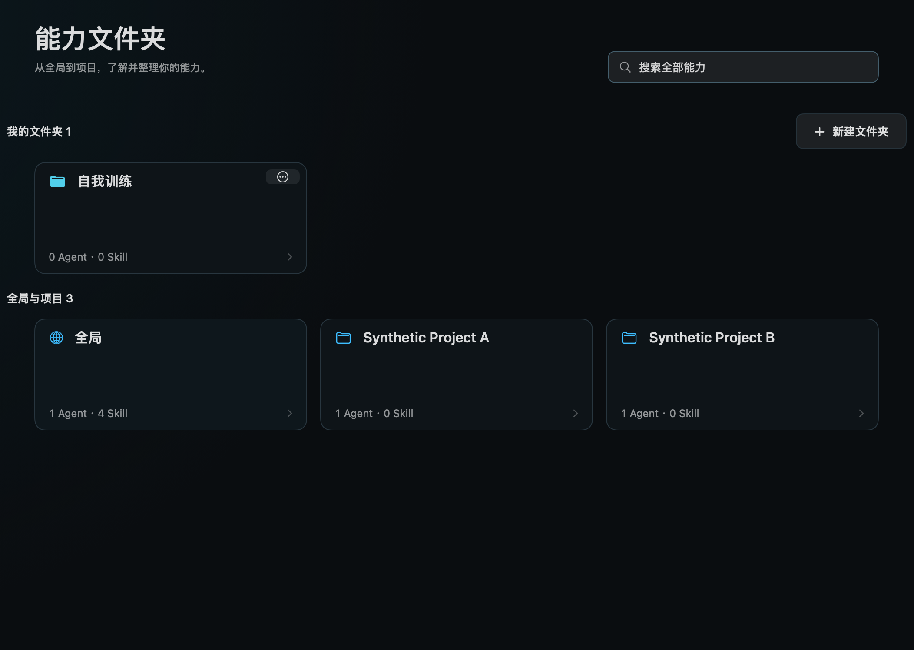
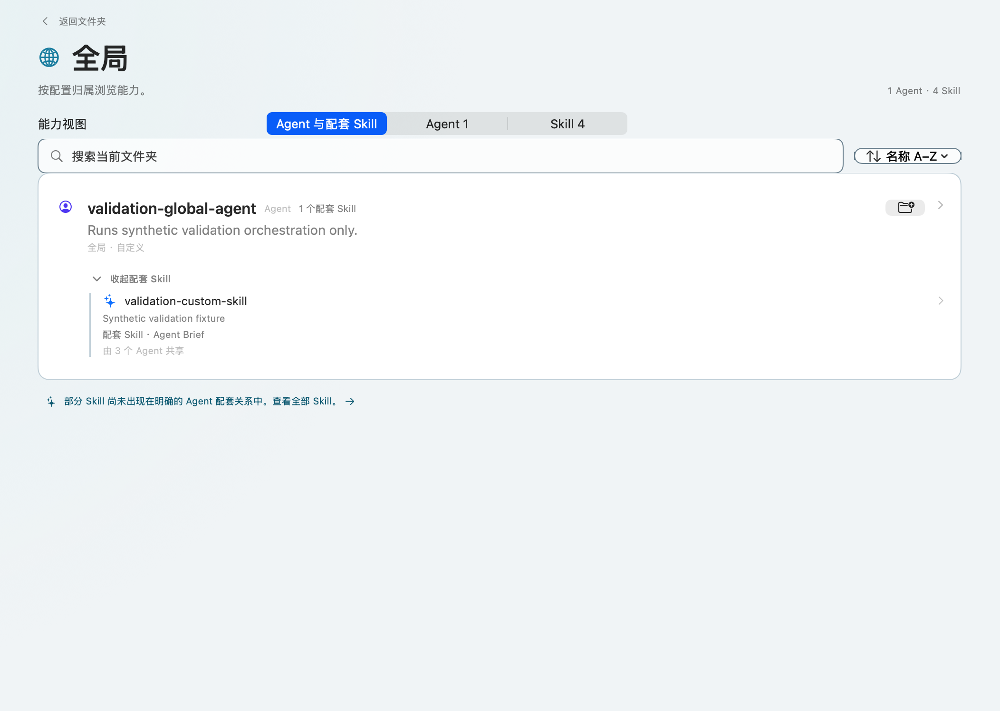

# Codex Director

Codex Director 是一款原生 macOS 应用，用于理解和迁移个人 Codex 能力系统。它盘点 Agent、Skill、已安装插件、项目使用证据和人工评价，同时不会把调用次数或任务完成直接解释为能力有效。

> 当前开发版本：`1.3.1`。需要 macOS 26 或更高版本。

[English](README.md) · [中文更新说明](CHANGELOG.zh-CN.md) · [English version notes](CHANGELOG.md)

## 功能

- 盘点全局、独立安装和项目级 Agent 与 Skill，并区分能力配置归属和项目使用情况。
- 展示经过隐私处理的近期使用证据和数据新鲜度，不把调用活动直接当作能力有效性的证明。
- 在证据旁保存轻量人工评价和本地整理信息。
- 导出开放且未加密的 `.codexpack.zip`，包含清单、校验和、插件/依赖列表和双语恢复说明。
- 可在本机通过隔离校验和预检流程恢复可信的 `.codexpack.zip`。只创建缺失文件、跳过完全相同的文件、遇到冲突即停止，绝不执行或安装包内内容。写入前会创建权限为 0700 的私有隔离区；失败清理与会话内撤销只会把已确认且未变化的对象移出逻辑目标路径并保留在隔离区，Codex Director 绝不会自动销毁其中内容。结果页可在 Finder 中显示本机目录，由用户检查后自行删除。
- 支持简体中文与英文、Light 与 Dark 主题，以及共享后台刷新。
- 默认在 macOS 菜单栏显示隐私安全的额度摘要；当 Codex 账户同时报告两个额度窗口时显示五小时和周额度，否则只显示可用的一个百分比，也可在设置中关闭。弹窗显示各自的重置时间、重置卡数量、刷新数据和打开主窗口。开启后，账户额度会在正常唤醒、解锁且非低电量模式下按 5/30 分钟自适应刷新，锁定、睡眠或低电量模式时暂停。
- 首页的当前五小时与周额度圆环使用同一份脱敏实时账户数据保持同步；七日周额度柱状图仍只采用同一来源的本地索引观测，不把实时值伪装成历史证据。

Codex Director 对源能力保持只读，不上传能力正文、会话、凭证、Cookie、Director 数据库或插件文件。完整边界见[隐私说明](PRIVACY.md)。

## 能力文件夹

“能力文件夹”页面只预建一个空的“自我训练”文件夹。你可以新增、重命名、删除、排序和搜索自定义文件夹，也可以通过多选面板导入已有 Agent/Skill，并把同一个能力加入多个文件夹。升级时会保留已有文件夹成员，不会自动加入任何能力。文件夹只保存稳定的文件夹 ID 与能力 ID，不会修改能力源文件，也不会保存路径、能力正文或会话数据。

每个文件夹内部提供“Agent 与配套 Skill / Agent / Skill”三个 Tab。配套关系只读取明确声明；文件夹外的关联能力仅作预览，不计入成员数量，也不会自动加入。插件提供的 Skill 会进入“全局”；插件本体、系统能力、MCP、工具、指令和旧插件缓存不会进入文件夹。文件夹设置独立于派生数据库，也不会进入 `.codexpack.zip` 能力包。

界面采用响应式文件夹网格、紧凑描边清单、品牌描边 Tab 和原位详情侧栏，统一分组边距并明确模块与控件之间的留白。当前窗口会话内，每个“文件夹＋Tab”分别保留搜索、排序、所选 Tab 和关系展开状态。Skill 详情可反向查看关联 Agent；配套声明与近七天同会话证据分开展示，共同出现既不证明调用关系，也不证明能力有效。

## 产品截图

以下原生 Debug 验证截图仅使用合成数据。能力文件夹截图展示 1.3.0 的 Light / Dark 内容区，不含窗口工具栏、玻璃侧栏、生产数据、用户路径、会话或凭证。





## 从源码构建

需要 macOS 26+、Xcode 26、Swift 6 和 XcodeGen。

```bash
git clone https://github.com/SimuDesign/Codex-Director.git
cd Codex-Director
./scripts/verify.sh
./scripts/build-local-app.sh
```

项目使用 Swift Package Manager，并将 ZIPFoundation 精确锁定为 `0.9.20`。完整工具链和验证要求见[构建说明](docs/BUILDING.md)，可复现的合成性能门槛见[性能说明](docs/PERFORMANCE.md)。

## 社区构建

GitHub Releases 可能提供由 GitHub Actions 构建的 universal macOS ZIP。社区构建使用 ad-hoc 代码签名，**没有 Apple Developer ID，也没有经过 Apple 公证**。

打开下载版本前，请先验证 SHA-256 和 GitHub artifact attestation。macOS 首次启动时可能阻止应用；只有在确认来源可信并完成验证后，才使用 Apple 官方的“仍要打开”流程。不要全局关闭 Gatekeeper。详见[安装说明](docs/INSTALL.md)。

## 参与贡献

请先阅读 [CONTRIBUTING.md](CONTRIBUTING.md)。Bug 和诊断信息不得包含真实提示词、能力正文、用户名、项目路径、会话、凭证或 Cookie。

## 许可证

源代码使用 [MIT License](LICENSE)。项目素材和第三方组件分别见 [ASSETS_LICENSE.md](ASSETS_LICENSE.md) 与 [THIRD_PARTY_NOTICES.md](THIRD_PARTY_NOTICES.md)。
