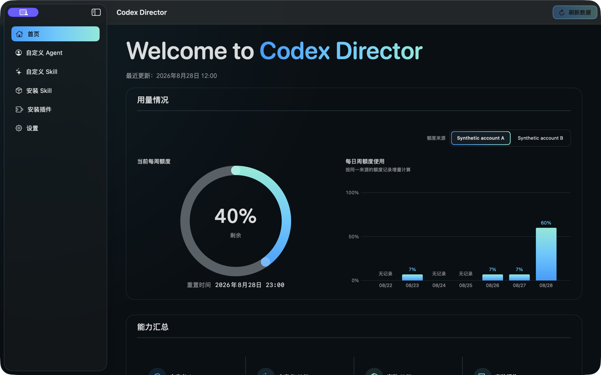
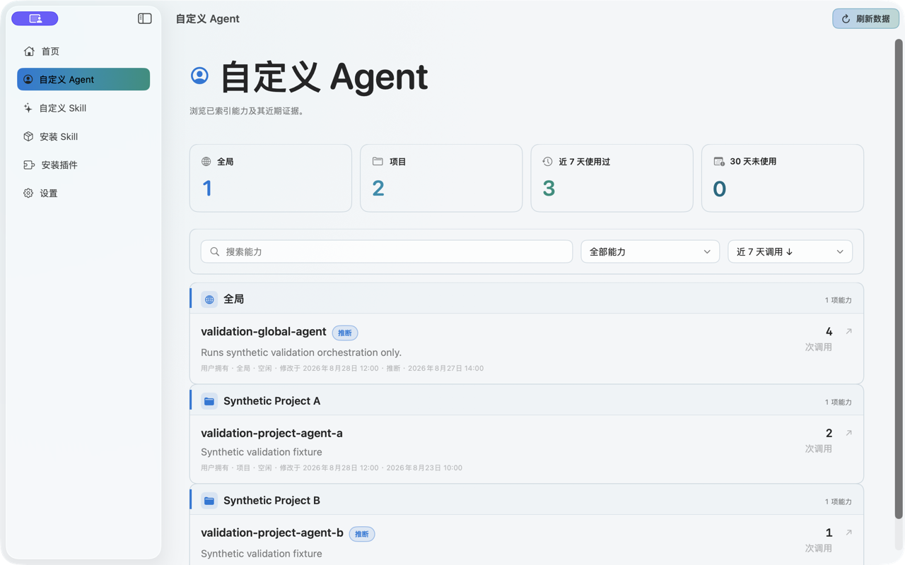
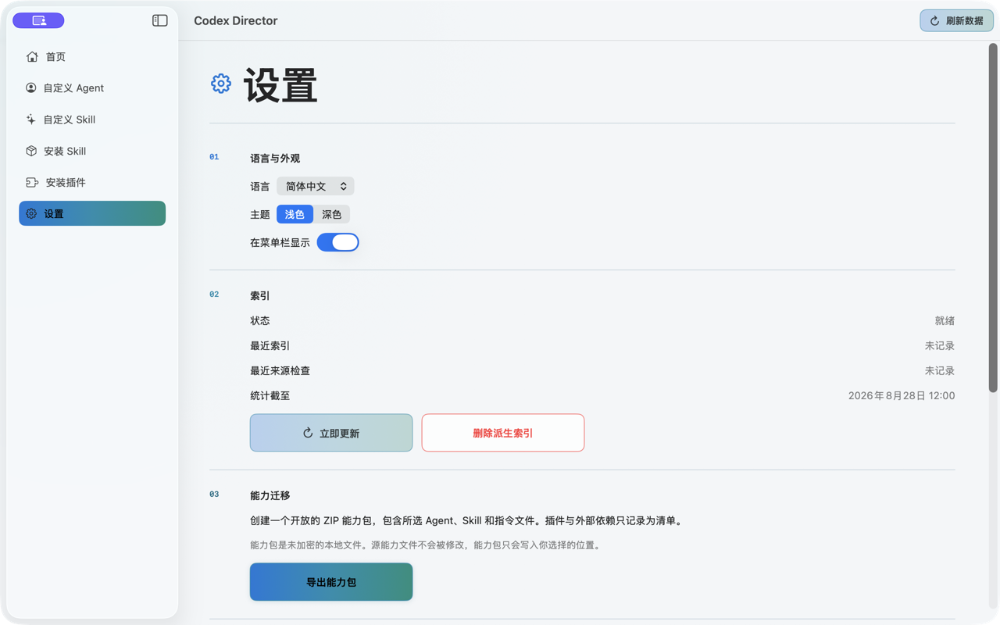

# Codex Director

Codex Director 是一款原生 macOS 应用，用于理解和迁移个人 Codex 能力系统。它盘点 Agent、Skill、已安装插件、项目使用证据和人工评价，同时不会把调用次数或任务完成直接解释为能力有效。

> 当前开发版本：`1.0.0`。需要 macOS 26 或更高版本。

[English](README.md)

## 功能

- 盘点全局、独立安装和项目级 Agent 与 Skill，并区分能力配置归属和项目使用情况。
- 展示经过隐私处理的近期使用证据和数据新鲜度，不把调用活动直接当作能力有效性的证明。
- 在证据旁保存轻量人工评价和分类修正。
- 导出开放且未加密的 `.codexpack.zip`，包含清单、校验和、插件/依赖列表和双语恢复说明。
- 支持简体中文与英文、Light 与 Dark 主题，以及共享后台刷新。
- 默认在 macOS 菜单栏显示隐私安全的当前周额度摘要，也可在设置中关闭；支持从菜单栏刷新数据或打开主窗口。开启后，账户额度会在正常唤醒、解锁且非低电量模式下按 5/30 分钟自适应刷新，锁定、睡眠或低电量模式时暂停。

Codex Director 对源能力保持只读，不上传能力正文、会话、凭证、Cookie、Director 数据库或插件文件。完整边界见[隐私说明](PRIVACY.md)。

## 产品截图

以下三张 1280×800 合成截图展示 Light 与 Dark 下的已发布层级。截图不含生产数据、用户路径、会话或凭证。





## 从源码构建

需要 macOS 26+、Xcode 26、Swift 6 和 XcodeGen。

```bash
git clone https://github.com/SimuDesign/Codex-Director.git
cd Codex-Director
./scripts/verify.sh
./scripts/build-local-app.sh
```

项目使用 Swift Package Manager，并将 ZIPFoundation 精确锁定为 `0.9.20`。完整工具链和验证要求见[构建说明](docs/BUILDING.md)，可复现的合成性能门槛见[性能说明](docs/PERFORMANCE.md)。

## 社区构建

GitHub Releases 可能提供由 GitHub Actions 构建的 universal macOS ZIP。社区构建使用 ad-hoc 代码签名，**没有 Apple Developer ID，也没有经过 Apple 公证**。

打开下载版本前，请先验证 SHA-256 和 GitHub artifact attestation。macOS 首次启动时可能阻止应用；只有在确认来源可信并完成验证后，才使用 Apple 官方的“仍要打开”流程。不要全局关闭 Gatekeeper。详见[安装说明](docs/INSTALL.md)。

## 参与贡献

请先阅读 [CONTRIBUTING.md](CONTRIBUTING.md)。Bug 和诊断信息不得包含真实提示词、能力正文、用户名、项目路径、会话、凭证或 Cookie。

## 许可证

源代码使用 [MIT License](LICENSE)。项目素材和第三方组件分别见 [ASSETS_LICENSE.md](ASSETS_LICENSE.md) 与 [THIRD_PARTY_NOTICES.md](THIRD_PARTY_NOTICES.md)。
