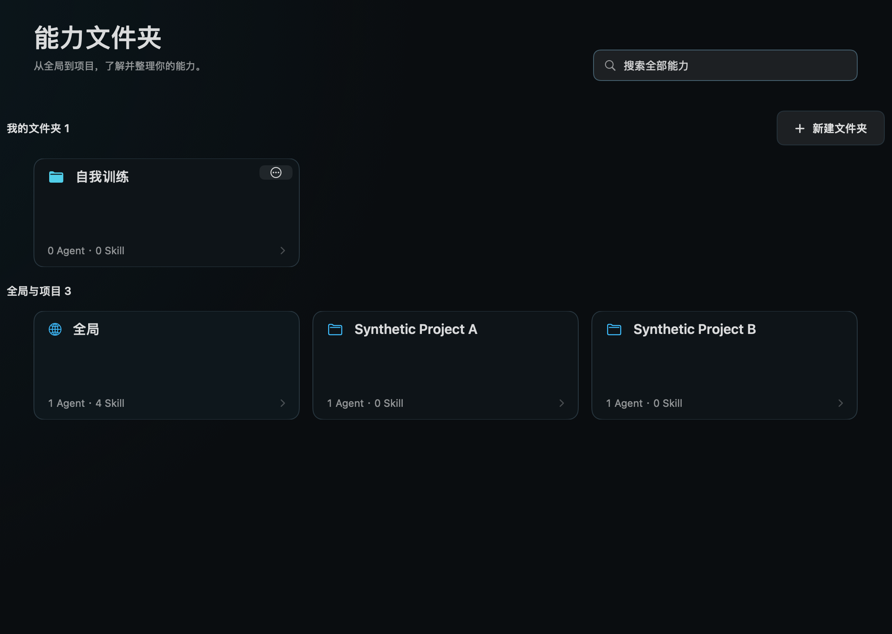
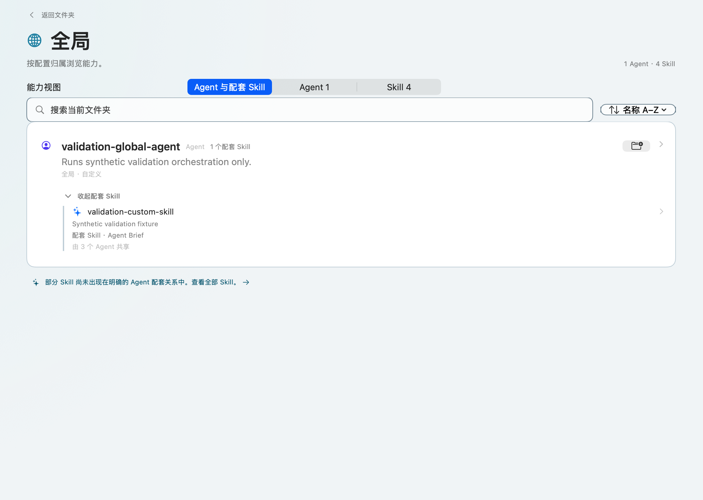
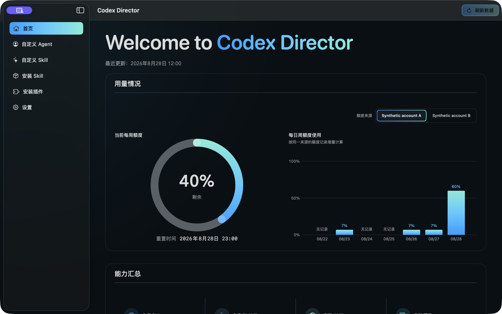
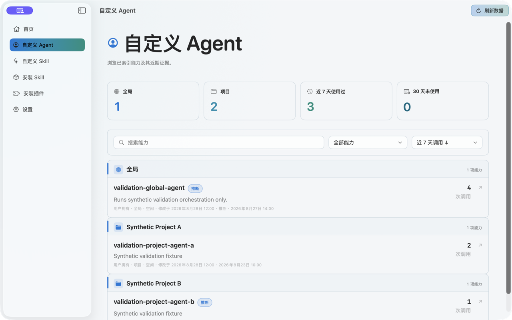
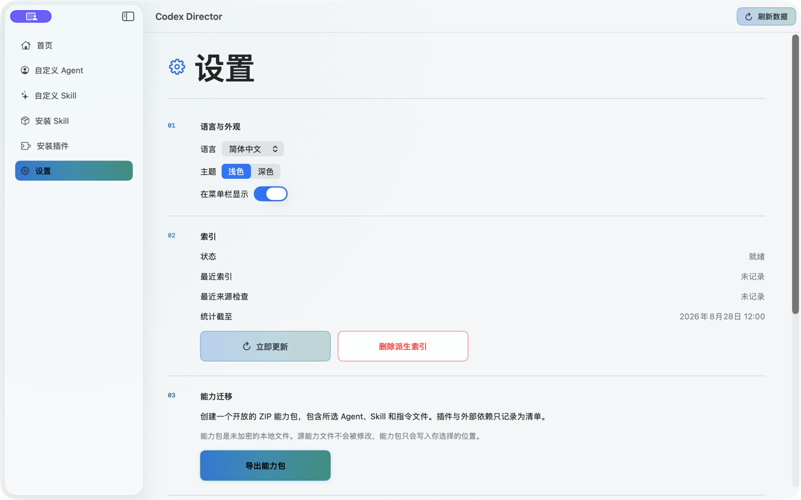

# Codex Director

Codex Director 是一款原生 macOS 应用，用于理解和迁移个人 Codex 能力系统。它盘点 Agent、Skill、已安装插件、项目使用证据和人工评价，同时不会把调用次数或任务完成直接解释为能力有效。

> 当前开发版本：`1.5.0`。需要 macOS 26 或更高版本。

使用证据区分真实子 Agent 委派、Agent 方法文档读取和 Skill 文件读取。
委派请求和子会话继承历史不会重复增加能力总量；读取或调度不等于能力有效，
动态或有歧义的操作可能仍未被观察到。升级后的首次刷新会在后台修复最近 30 天
的证据，不清空文件夹或评价。

[English](README.md) · [中文更新说明](CHANGELOG.zh-CN.md) · [English version notes](CHANGELOG.md)

## 功能

- 盘点全局、独立安装和项目级 Agent 与 Skill，并区分能力配置归属和项目使用情况。
- “安装 Skill”的总数、清单和使用排行只统计独立安装的 Skill；安装插件单独计数。已观察到的插件附带 Skill 可在能力文件夹中按来源查看，但不混入独立安装统计。
- 展示经过隐私处理的近期使用证据和数据新鲜度，不把调用活动直接当作能力有效性的证明。
- 首页可按近 7 天或近 30 个本地自然日排列已观察到的能力调用。首次默认近 7 天，之后记住上次选择；切换周期不会重新索引或临时查询数据库。
- Agent、Skill、插件清单提供“近 30 天调用 ↓”排序。能力文件夹三个 Tab 显示已记录调用次数，独立提供并记住“近 7 天 / 近 30 天”周期，可按调用量或名称排序；切换周期和排序复用已加载统计。
- 在证据旁保存轻量人工评价和本地整理信息。
- 导出开放且未加密的 `.codexpack.zip`，包含清单、校验和、插件/依赖列表和双语恢复说明。
- 可在本机通过隔离校验和预检流程恢复可信的 `.codexpack.zip`。只创建缺失文件、跳过完全相同的文件、遇到冲突即停止，绝不执行或安装包内内容。写入前会创建权限为 0700 的私有隔离区；失败清理与会话内撤销只会把已确认且未变化的对象移出逻辑目标路径并保留在隔离区，Codex Director 绝不会自动销毁其中内容。结果页可在 Finder 中显示本机目录，由用户检查后自行删除。
- 支持简体中文与英文、Light 与 Dark 主题，以及共享后台刷新。
- 默认在 macOS 菜单栏显示隐私安全的额度摘要；当 Codex 账户同时报告两个额度窗口时显示五小时和周额度，否则只显示可用的一个百分比，也可在设置中关闭。弹窗显示各自的重置时间、重置卡数量、刷新数据和打开主窗口。开启后，仅当精确的 `com.openai.codex` 应用位于前台时采用 1 分钟账户读取节奏；确认离开后的 10 分钟内为 2 分钟，缓冲结束且其他应用仍在前台时为 5 分钟，聚合键鼠空闲达到 30 分钟后为 30 分钟。前台身份未知时保守采用 2 分钟。前台只表示接收键盘事件的应用，不表示 Codex 后台任务是否正在运行。打开弹窗也会补读缺失、过期或至少 2 分钟前的额度数据。锁定、睡眠或低电量模式时暂停。
- 首页的当前五小时与周额度圆环使用同一份脱敏实时账户数据保持同步；七日周额度柱状图仍只采用同一来源的本地索引观测，不把实时值伪装成历史证据。

Codex Director 对源能力保持只读，不上传能力正文、会话、凭证、Cookie、Director 数据库或插件文件。完整边界见[隐私说明](PRIVACY.md)。

## 能力文件夹

“能力文件夹”页面只预建一个空的“自我训练”文件夹。你可以新增、重命名、删除和排序自定义文件夹，也可以通过多选面板导入已有 Agent/Skill，并把同一个能力加入多个文件夹。入口搜索按名称查找自定义、全局和项目文件夹；进入文件夹后再搜索其中的能力。升级时会保留已有文件夹成员，不会自动加入任何能力。文件夹只保存稳定的文件夹 ID 与能力 ID，不会修改能力源文件，也不会保存路径、能力正文或会话数据。

每个文件夹内部提供“Agent 与配套 Skill / Agent / Skill”三个 Tab。配套关系只读取明确声明；文件夹外的关联能力仅作预览，不计入成员数量，也不会自动加入。插件提供的 Skill 会进入“全局”；插件本体、系统能力、MCP、工具、指令和旧插件缓存不会进入文件夹。文件夹设置独立于派生数据库，也不会进入 `.codexpack.zip` 能力包。

界面采用响应式文件夹网格、紧凑描边清单、品牌描边 Tab 和原位详情侧栏，统一分组边距并明确模块与控件之间的留白。当前窗口会话内，每个“文件夹＋Tab”分别保留搜索、排序、所选 Tab 和关系展开状态。Skill 详情可反向查看关联 Agent；配套声明与近七天同会话证据分开展示，共同出现既不证明调用关系，也不证明能力有效。

文件夹内调用次数覆盖**全部使用项目**，不局限于配置归属项目或当前文件夹。Agent 和关联预览 Skill 分别显示自身次数，不把共享 Skill 的次数加到 Agent 上。统计尚未就绪显示 `—`；`0` 仅表示所计算周期内没有观测，不证明能力从未被使用。文件夹周期独立于首页排行保存，不改变成员关系或源文件。

## 产品截图

以下原生 Debug 验证截图仅使用合成数据。能力文件夹截图展示 1.3.0 的 Light / Dark 内容区，不含窗口工具栏、玻璃侧栏、生产数据、用户路径、会话或凭证。








## 从源码构建

需要 macOS 26+、Xcode 26、Swift 6 和 XcodeGen。

```bash
git clone https://github.com/SimuDesign/Codex-Director.git
cd Codex-Director
./scripts/verify.sh
./scripts/build-local-app.sh
```

项目使用 Swift Package Manager，并将 ZIPFoundation 精确锁定为 `0.9.20`。完整工具链和验证要求见[构建说明](docs/BUILDING.md)，可复现的合成性能门槛见[性能说明](docs/PERFORMANCE.md)。

## 社区构建

GitHub Releases 可能提供由 GitHub Actions 构建的 universal macOS ZIP。社区构建使用 ad-hoc 代码签名，**没有 Apple Developer ID，也没有经过 Apple 公证**。

打开下载版本前，请先验证 SHA-256 和 GitHub artifact attestation。macOS 首次启动时可能阻止应用；只有在确认来源可信并完成验证后，才使用 Apple 官方的“仍要打开”流程。不要全局关闭 Gatekeeper。详见[安装说明](docs/INSTALL.md)。

## 参与贡献

请先阅读 [CONTRIBUTING.md](CONTRIBUTING.md)。Bug 和诊断信息不得包含真实提示词、能力正文、用户名、项目路径、会话、凭证或 Cookie。

## 许可证

源代码使用 [MIT License](LICENSE)。项目素材和第三方组件分别见 [ASSETS_LICENSE.md](ASSETS_LICENSE.md) 与 [THIRD_PARTY_NOTICES.md](THIRD_PARTY_NOTICES.md)。
